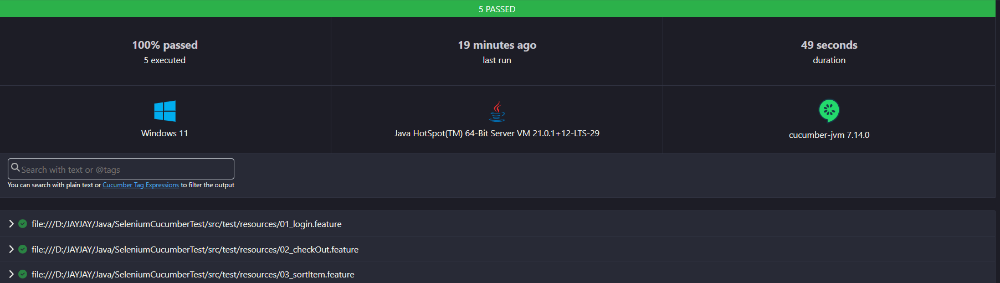

# Web Automation Test Framework Using Integration Selenium & Cucumber

## Overview
This Web Automation Test project using selenium integrated with cucumber and for programing language using Java and Gradle
- Web automation task : https://www.saucedemo.com/

## Getting Started
These instruction will guide you on how to set up project on your local machine

## Prerequisites
Before getting started, ensure that you have the following software installed on your machine:

```
1. Java JDK: download and install the latest version of Java JDK from the official Oracle website (https://www.oracle.com/id/java/technologies/downloads/).
2. Gradle: Install Gradle by following the official Gradle installation guide (https://gradle.org/install/), but in this case, we are using 'gradlew'.

```

### Installing

To set up the development environment, follow these steps:

1. Clone this repository to your local machine using Git or download the ZIP file and extract it.
2. Open the project in your preferred Java IDE (e.g., IntelliJ or Eclipse).
3. Build the project and download dependencies using Gradle by running the following command in the terminal:

```
./gradlew build

```

## Running the tests

To execute the automated tests, run the following Gradle task:

```
./gradlew cucumber

```

## Test result
#### Cucumber Test


#### Github Workflow


